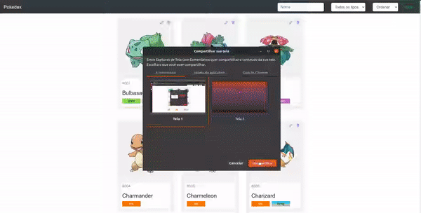

# On9-Accenture-S5-ProjetoGuiado1 #

Pokedex em Javascript

  </img>

## Objetivos

**Geral:** Implementar funcionalidades a uma Pokedex

**Específico:**
- Exercitar utilização de lógica básica;
- Exercitar utilização de objetos e array;
- Exercitar utilização de métodos nativos da linguagem.

## Especificações do projeto

A Pokedex construída deverá **obrigatoriamente** possuir as seguintes funções:
- Filtrar pokemons por:
    - Nome
    - Tipo
- Ordenar pokemons por:
    - Id (crescente e decrescente)
    - Nome (crescente e decrescente)
- Adicionar novo pokemon;
- Obter dados de um pokemon;
- Editar pokemon existente;
- Excluir pokemon.

Observação: A imagem dos pokemons já existe numa pasta e é buscada através do nome do mesmo. Para adicionar novos pokemons utilize um da lista [Geração 2](https://veekun.com/dex/pokemon/search?sort=evolution-chain&introduced_in=2). Só não utilize mega evoluções... Todas as informações de nome, tipo e status dos pokemons estão nesse link.

**Divirtam-se!!**
